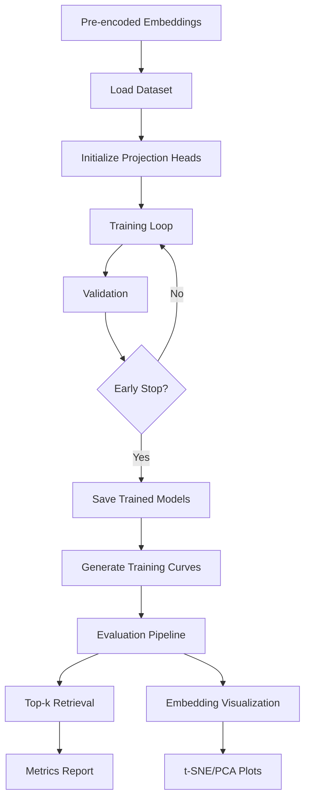

# Cross-Modal Projection Head Pipeline

Train and evaluate projection heads for aligning SigLIP image embeddings with E5-Mistral text embeddings using COCO dataset.

## Quick Setup

**Required Directory Structure:**
```
xclip-siglip/
├── pretrain_encoded/          # Put pre-encoded embeddings here
│   ├── train2017_image_embeddings.pt
│   ├── train2017_text_embeddings.pt
│   ├── train2017_metadata.json       # REQUIRED for proper splitting
│   ├── val2017_image_embeddings.pt
│   └── val2017_text_embeddings.pt
└── pipeline/                  # This directory
    ├── train.py
    ├── evaluate.py
    ├── split_train_data.py
    ├── tune_hyperparams.py    # Hyperparameter tuning (NEW!)
    ├── models.py              # Model definitions
    ├── losses.py              # Loss functions  
    ├── metrics.py             # Evaluation metrics
    ├── dataset.py             # Dataset handling
    ├── optuna_config.yaml     # Tuning configuration
    ├── HYPERPARAMETER_TUNING.md  # Detailed tuning guide
    └── configs/
```

**Essential Steps:**
1. **Get pre-encoded embeddings** (from `../encoding.py`) - ensures metadata is created
2. **Split data**: `python split_train_data.py` (REQUIRED - creates image-level splits + tuning subset)
3. **Hyperparameter tuning** (optional): `python tune_hyperparams.py` 
4. **Train**: `python train.py configs/quick_test.yaml` or `python train.py best_hyperparams_config.yaml`
5. **Evaluate**: `python evaluate.py configs/quick_test.yaml`

## Pipeline Workflow



## Hyperparameter Tuning (NEW!)

**Automated hyperparameter optimization using Optuna:**

### Quick Start Hyperparameter Tuning
```bash
# 1. Create tuning subset (if not already done)
python split_train_data.py

# 2. Run hyperparameter tuning with specific config
python tune_hyperparams.py optuna_configs/default.yaml

# 3. Use best results for final training
python train.py optuna_results/best_config.yaml
```

### Configuration Files

The tuning script now uses configuration files from the `optuna_configs/` directory:

**Available Configurations:**
- `optuna_configs/default.yaml` - Multi-model search (all architectures, 150 trials)
- `optuna_configs/siglip.yaml` - SigLIP-focused optimization (50 trials)
- `optuna_configs/clip.yaml` - CLIP-focused optimization (50 trials)  
- `optuna_configs/attention.yaml` - Attention architecture tuning (75 trials)
- `optuna_configs/mlp.yaml` - MLP baseline optimization (40 trials)

**Usage Examples:**
```bash
# Multi-model hyperparameter search
python tune_hyperparams.py optuna_configs/default.yaml

# Model-specific tuning
python tune_hyperparams.py optuna_configs/siglip.yaml
python tune_hyperparams.py optuna_configs/clip.yaml
python tune_hyperparams.py optuna_configs/attention.yaml
python tune_hyperparams.py optuna_configs/mlp.yaml

# Default config if no argument provided
python tune_hyperparams.py  # Uses optuna_configs/default.yaml
```

### Key Features
- **Fast tuning**: Uses 100K sample subset instead of full 473K dataset
- **Parallel execution**: Multiple trials run simultaneously (n_jobs=3)
- **Persistent results**: Trials saved to database, can resume if interrupted
- **YAML-based configuration**: Easy to modify search spaces
- **Multiple architectures**: Compares SigLIP, CLIP, Attention, and MLP heads
- **Multiple losses**: Tests sigmoid, softmax, and queue-based InfoNCE losses

### Expected Results
- **Typical runtime**: ~1-2 hours for 100 trials on modern GPUs
- **Performance**: Usually achieves 25-40% R@1 on final training
- **Best configuration saved**: `best_hyperparams_config.yaml` created automatically

### Advanced Usage

**Resume interrupted tuning:**
```bash
# Just run again with same config - automatically resumes from database
python tune_hyperparams.py optuna_configs/default.yaml
```

**Create custom configurations:**
```bash
# Copy existing config and modify
cp optuna_configs/default.yaml optuna_configs/my_custom.yaml
# Edit my_custom.yaml to change search space, study name, etc.
python tune_hyperparams.py optuna_configs/my_custom.yaml
```

**Check results:**
```python
import optuna
study = optuna.load_study("xclip_siglip_tuning", storage="sqlite:///optuna_study.db")
print(f"Best R@1: {study.best_value:.4f}")
print(f"Best params: {study.best_params}")
```


## Quick Start

## Model Architectures

Choose your projection head in config files:

**1. MLP** (`type: "mlp"`) - Simple baseline
```yaml
model:
  type: "mlp"
  output_dim: 512
  hidden_dim: 1024
  dropout: 0.1
```

**2. Attention** (`type: "attention"`) - Self-attention refinement  
```yaml
model:
  type: "attention"
  output_dim: 512
  hidden_dim: 1024
  num_heads: 8
  num_layers: 2
  dropout: 0.1
```

**3. Cross-Modal** (`type: "cross_modal"`) - Cross-attention between modalities
```yaml
model:
  type: "cross_modal" 
  output_dim: 512
  hidden_dim: 1024
  num_heads: 8
  dropout: 0.1
```

## SOTA Projection Heads

**4. SigLIP** (`type: \"siglip\"`) - Authentic SigLIP architecture
```yaml
model:
  type: \"siglip\"
  output_dim: 512
  dropout: 0.0              # SigLIP uses no dropout
loss:
  type: \"siglip\"            # Authentic sigmoid loss
  temperature: 0.01         # Lower temperature than CLIP
```

**5. CLIP** (`type: \"clip\"`) - Learnable temperature scaling
```yaml
model:
  type: \"clip\"
  output_dim: 512
  hidden_dim: 1024      # Defaults to input_dim // 2
  dropout: 0.1
  learnable_temp: true  # Key CLIP innovation
loss:
  type: \"clip\"          # Uses learnable temperature
```

**6. ALIGN** (`type: \"align\"`) - Batch normalization and larger capacity
```yaml
model:
  type: \"align\"
  output_dim: 512
  hidden_dim: 2048      # Larger hidden dimensions
  dropout: 0.1
  use_bn: true          # BatchNorm instead of LayerNorm
loss:
  type: \"align\"
```

**7. BLIP** (`type: \"blip\"`) - Momentum contrastive learning
```yaml
model:
  type: \"blip\"
  output_dim: 512
  hidden_dim: 1024
  dropout: 0.1
  momentum: 0.999       # Momentum coefficient
loss:
  type: \"blip\"
  alpha: 0.4            # Momentum loss weight
```

## Data Splits (After `split_train_data.py`)

⚠️ **CRITICAL**: The pipeline uses **image-level splitting** to prevent data leakage.

**Image-Level Splits:**
- **Training** (~473K samples from ~95K images): Full dataset for final training (`train_*.pt`)
- **Training Subset** (~100K samples): Fast hyperparameter tuning (`train_tuning_*.pt`)
- **Validation** (~5K samples from ~1K images): Early stopping (`val_*.pt`)  
- **Test** (~24K samples from ~5K images): Final evaluation (`test_*.pt`)

**No Data Leakage**: Train and test contain completely separate images.
**Tuning Subset**: Random 100K samples from training set for fast hyperparameter exploration.

**Data Flow:**
```
Raw COCO → encoding.py → train2017_*.pt + metadata.json
              ↓
         split_train_data.py → IMAGE-LEVEL split
              ↓
     train_*.pt, val_*.pt, test_*.pt + metadata
              ↓
          train.py (uses train + val)
              ↓
         evaluate.py (uses test only with proper COCO metrics)
```

## Custom Model Design

**To create a new projection head:**

1. **Copy existing config**: `cp configs/mlp_baseline.yaml my_model.yaml`

2. **Edit model section**:
```yaml
model:
  type: "attention"           # Choose: mlp, attention, cross_modal
  output_dim: 512            # Final embedding dimension 
  hidden_dim: 1024           # Hidden layer size
  num_heads: 8               # (attention/cross_modal only)
  num_layers: 2              # (attention only) 
  dropout: 0.1               # Regularization
```

3. **Tune hyperparameters**:
```yaml
training:
  batch_size: 512            # Adjust for GPU memory
  learning_rate: 1e-4        # Start with 1e-4, try 5e-4 or 1e-5
  weight_decay: 0.01         # L2 regularization
  num_epochs: 50             # Max epochs
  patience: 5                # Early stopping

loss:
  temperature: 0.05          # Lower = stricter alignment (try 0.01-0.1)
```

4. **Train and evaluate**:
```bash
python train.py my_model.yaml
python evaluate.py my_model.yaml
```

## Results

**Evaluation Metrics:**
- **I2T Recall@K**: Finds best rank among all captions of same image (COCO-aware)
- **T2I Recall@K**: Finds rank of exact corresponding image (standard)
- **Visualizations**: t-SNE and PCA plots of learned embedding space
- **Test Set**: Evaluated on ~24K held-out samples from separate images
- **Data Integrity**: No leakage between train/test image sets

**Output Files:**
- `results/config_name/best_model.pt` - Trained model
- `results/config_name/training_curves.png` - Training and validation loss plot
- `results/config_name/loss_history.json` - Loss values for each epoch
- `results/config_name/evaluation_results/` - Metrics and visualizations

## Troubleshooting

### General Issues
**"Error: Test set not found"** → Run `python split_train_data.py` first  
**"Error: Missing required data files"** → Check `pretrain_encoded/` has the required `.pt` files  
**"Error: No image_ids in metadata"** → Run `../encoding.py` to create metadata.json  
**MPS errors on Apple Silicon** → Pipeline handles this automatically

### Hyperparameter Tuning Issues
**"CategoricalDistribution does not support dynamic value space"** → Parameter ranges changed between studies. Either:
- Use same study name with identical parameter ranges, OR
- Use new study name for different parameter ranges

**"DataLoader worker exited unexpectedly"** → Reduce `n_jobs` or `batch_size` in `optuna_config.yaml`

**"RuntimeError: mat1 and mat2 shapes cannot be multiplied"** → Fixed automatically with queue reinitialization

**Process killed/OOM** → Reduce `n_jobs` (try n_jobs=1 for 16GB RAM, n_jobs=2 for 32GB RAM)

**"Trial X failed with value None"** → Normal for some trials, tuning continues. Check for pattern in failed trials.

**Very slow trials (>5 minutes each)** → Check if using tuning subset files (`train_tuning_*.pt`). If not, run `python split_train_data.py`

**Device Support:**
- CUDA (NVIDIA), MPS (Apple Silicon), CPU - automatically detected
- Set `device: "cuda"/"mps"/"cpu"` to force specific device

**Batch Experiments:**
```bash
for config in configs/*.yaml; do
    python train.py $config
    python evaluate.py $config  
done
```

## Adding New Models/Metrics

**To add a new projection head (e.g., "transformer"):**

1. **Define model class in `models.py`**:
```python
class TransformerProjectionHead(nn.Module):
    def __init__(self, input_dim, output_dim, num_layers, num_heads, dropout=0.1):
        super().__init__()
        self.transformer = nn.TransformerEncoder(
            nn.TransformerEncoderLayer(input_dim, num_heads, dropout=dropout),
            num_layers
        )
        self.projection = nn.Linear(input_dim, output_dim)
    
    def forward(self, x):
        x = x.unsqueeze(1)  # Add sequence dimension
        x = self.transformer(x).squeeze(1)
        return F.normalize(self.projection(x), dim=-1)
```

2. **Update `create_model()` function in `models.py`**:
```python
elif model_type == 'transformer':
    image_head = TransformerProjectionHead(
        image_dim, model_config['output_dim'], 
        model_config['num_layers'], model_config['num_heads']
    )
    text_head = TransformerProjectionHead(
        text_dim, model_config['output_dim'],
        model_config['num_layers'], model_config['num_heads']  
    )
    return image_head, text_head, False
```

3. **Create config file `configs/transformer.yaml`**:
```yaml
model:
  type: "transformer"
  output_dim: 512
  num_layers: 3
  num_heads: 8
```

**To add new evaluation metrics:**

1. **Add metric function in `evaluate.py`**:
```python
def compute_map_at_k(similarities, k=10):
    """Compute Mean Average Precision@K"""
    # Your implementation here
    return map_score

# In compute_retrieval_metrics():
metrics['map@10'] = compute_map_at_k(similarities, k=10)
```

2. **The metric will automatically appear in results**

**To add new loss functions:**

1. **Add loss function in `losses.py`**:
```python
def custom_loss(image_features, text_features, temperature=0.05):
    """Your custom loss implementation"""
    # Your implementation here
    return loss
```

2. **Update `compute_loss()` function in `losses.py`**:
```python
elif loss_type == 'custom':
    return custom_loss(image_proj, text_proj, float(config['loss']['temperature']))
```

## Important Notes

### Data Integrity
- ✅ **Image-level splitting**: No images appear in both train and test
- ✅ **Proper COCO evaluation**: I2T considers all captions of same image
- ✅ **Accurate T2I metrics**: Finds rank of exact corresponding image

### Code Organization  
- **`models.py`**: All projection head definitions and model factory
- **`losses.py`**: All loss functions (SigLIP, CLIP, ALIGN, BLIP)
- **`train.py`**: Training logic only
- **`evaluate.py`**: Evaluation with proper COCO handling
- **`split_train_data.py`**: Image-level data splitting

### Performance Notes
- Lower T2I scores are expected (now accurate, not inflated)
- I2T scores benefit from COCO's multiple captions per image
- Proper data splits ensure realistic generalization metrics
- Training curves automatically saved to monitor convergence and overfitting

## Quick SOTA Model Testing

```bash
# Test all SOTA models
python train.py configs/siglip.yaml           # Authentic SigLIP with sigmoid loss
python train.py configs/clip.yaml             # CLIP with learnable temperature  
python train.py configs/align.yaml            # ALIGN with batch normalization
python train.py configs/blip.yaml             # BLIP with momentum learning

# Evaluate results
python evaluate.py configs/siglip.yaml
python evaluate.py configs/clip.yaml
python evaluate.py configs/align.yaml  
python evaluate.py configs/blip.yaml
```

**Expected Differences:**
- **SigLIP**: Authentic sigmoid loss, simple architecture, lower temperature
- **CLIP**: Logs learned temperature, may converge faster
- **ALIGN**: Uses BatchNorm, good for larger batch sizes
- **BLIP**: Momentum updates, more stable training
