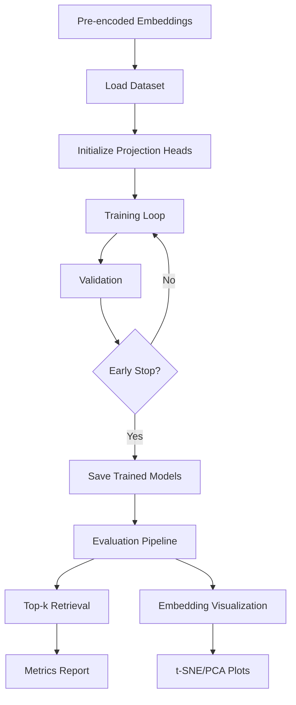

# Cross-Modal Projection Head Pipeline

Train and evaluate projection heads for aligning SigLIP image embeddings with E5-Mistral text embeddings using COCO dataset.

## Quick Setup

**Required Directory Structure:**
```
xclip-siglip/
├── pretrain_encoded/          # Put pre-encoded embeddings here
│   ├── train2017_image_embeddings.pt
│   ├── train2017_text_embeddings.pt  
│   ├── val2017_image_embeddings.pt
│   └── val2017_text_embeddings.pt
└── pipeline/                  # This directory
    ├── train.py
    ├── evaluate.py
    ├── split_train_data.py
    └── configs/
```

**Essential Steps:**
1. **Get pre-encoded embeddings** (from `../encoding.py`)
2. **Split data**: `python split_train_data.py` (REQUIRED before training)
3. **Train**: `python train.py configs/quick_test.yaml`
4. **Evaluate**: `python evaluate.py configs/quick_test.yaml`

## Pipeline Workflow



## Quick Start

## Model Architectures

Choose your projection head in config files:

**1. MLP** (`type: "mlp"`) - Simple baseline
```yaml
model:
  type: "mlp"
  output_dim: 512
  hidden_dim: 1024
  dropout: 0.1
```

**2. Attention** (`type: "attention"`) - Self-attention refinement  
```yaml
model:
  type: "attention"
  output_dim: 512
  hidden_dim: 1024
  num_heads: 8
  num_layers: 2
  dropout: 0.1
```

**3. Cross-Modal** (`type: "cross_modal"`) - Cross-attention between modalities
```yaml
model:
  type: "cross_modal" 
  output_dim: 512
  hidden_dim: 1024
  num_heads: 8
  dropout: 0.1
```

## Data Splits (After `split_train_data.py`)

The pipeline automatically creates proper ML splits:

- **Training** (~95K): Model training (`train_*.pt`)
- **Validation** (~5K): Early stopping (`val_*.pt`)  
- **Test** (~24K): Final evaluation (`test_*.pt`)

**Data Flow:**
```
Raw COCO → encoding.py → train2017_*.pt, val2017_*.pt
              ↓
         split_train_data.py → train_*.pt, val_*.pt, test_*.pt
              ↓
          train.py (uses train + val)
              ↓
         evaluate.py (uses test only)
```

## Custom Model Design

**To create a new projection head:**

1. **Copy existing config**: `cp configs/mlp_baseline.yaml my_model.yaml`

2. **Edit model section**:
```yaml
model:
  type: "attention"           # Choose: mlp, attention, cross_modal
  output_dim: 512            # Final embedding dimension 
  hidden_dim: 1024           # Hidden layer size
  num_heads: 8               # (attention/cross_modal only)
  num_layers: 2              # (attention only) 
  dropout: 0.1               # Regularization
```

3. **Tune hyperparameters**:
```yaml
training:
  batch_size: 512            # Adjust for GPU memory
  learning_rate: 1e-4        # Start with 1e-4, try 5e-4 or 1e-5
  weight_decay: 0.01         # L2 regularization
  num_epochs: 50             # Max epochs
  patience: 5                # Early stopping

loss:
  temperature: 0.05          # Lower = stricter alignment (try 0.01-0.1)
```

4. **Train and evaluate**:
```bash
python train.py my_model.yaml
python evaluate.py my_model.yaml
```

## Results

**Evaluation Metrics:**
- **Recall@K**: R@1, R@5, R@10, R@50 for both I2T and T2I retrieval
- **Visualizations**: t-SNE and PCA plots of learned embedding space
- **Test Set**: Evaluated on ~24K held-out samples

**Output Files:**
- `results/config_name/best_model.pt` - Trained model
- `results/config_name/evaluation_results/` - Metrics and visualizations

## Troubleshooting

**"Error: Test set not found"** → Run `python split_train_data.py` first  
**"Error: Missing required data files"** → Check `pretrain_encoded/` has the required `.pt` files  
**MPS errors on Apple Silicon** → Pipeline handles this automatically

**Device Support:**
- CUDA (NVIDIA), MPS (Apple Silicon), CPU - automatically detected
- Set `device: "cuda"/"mps"/"cpu"` to force specific device

**Batch Experiments:**
```bash
for config in configs/*.yaml; do
    python train.py $config
    python evaluate.py $config  
done
```

## Adding New Models/Metrics

**To add a new projection head (e.g., "transformer"):**

1. **Define model class in `train.py`**:
```python
class TransformerProjectionHead(nn.Module):
    def __init__(self, input_dim, output_dim, num_layers, num_heads, dropout=0.1):
        super().__init__()
        self.transformer = nn.TransformerEncoder(
            nn.TransformerEncoderLayer(input_dim, num_heads, dropout=dropout),
            num_layers
        )
        self.projection = nn.Linear(input_dim, output_dim)
    
    def forward(self, x):
        x = x.unsqueeze(1)  # Add sequence dimension
        x = self.transformer(x).squeeze(1)
        return F.normalize(self.projection(x), dim=-1)
```

2. **Update `create_model()` function in `train.py`**:
```python
elif model_type == 'transformer':
    image_head = TransformerProjectionHead(
        image_dim, model_config['output_dim'], 
        model_config['num_layers'], model_config['num_heads']
    )
    text_head = TransformerProjectionHead(
        text_dim, model_config['output_dim'],
        model_config['num_layers'], model_config['num_heads']  
    )
    return image_head, text_head, False
```

3. **Create config file `configs/transformer.yaml`**:
```yaml
model:
  type: "transformer"
  output_dim: 512
  num_layers: 3
  num_heads: 8
```

**To add new evaluation metrics:**

1. **Add metric function in `evaluate.py`**:
```python
def compute_map_at_k(similarities, k=10):
    """Compute Mean Average Precision@K"""
    # Your implementation here
    return map_score

# In compute_retrieval_metrics():
metrics['map@10'] = compute_map_at_k(similarities, k=10)
```

2. **The metric will automatically appear in results**
